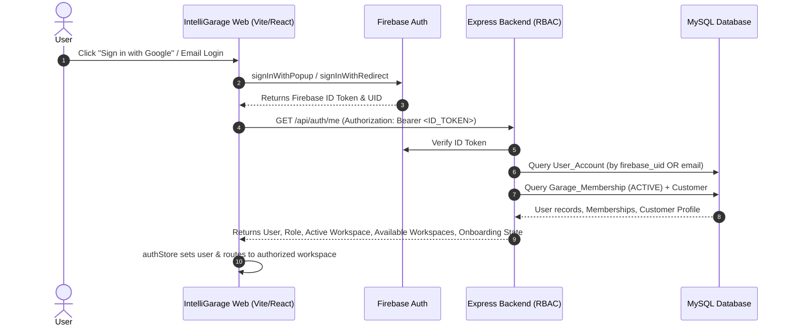

# INTELLIGARAGE — PERSISTENT ROLE, AUTO-REDIRECT, MULTI-ROLE & WORKSPACE SWITCHING REPORT

---

## 1. Existing Problem
Previously, when users logged in to IntelliGarage (via Google / Firebase Auth or dev credentials), they were frequently redirected to the **"Choose Role" (Onboarding)** screen on every login or refresh.
- Existing customers, owners, managers, and mechanics were forced to re-select account setup types.
- The system did not support multi-role accounts (e.g. an active Customer who is also an approved Manager or Mechanic at a garage).
- There was no authorized role/workspace switcher in the UI or backend.
- Role changes could potentially be manipulated via frontend state or client-side storage without backend verification.

---

## 2. Root Cause
1. **Unsynchronized Auth Profile Resolution**:
   - In `backend/server.js`, `/api/auth/me` checked for `req.user`. If `firebase_uid` was not yet stored on the initial `User_Account` record, `req.user` evaluated to null.
   - When querying `User_Account`, if the query did not match by `firebase_uid` OR fallback email, or if it hit a branch with missing metadata, it returned `{ requiresOnboarding: true }` regardless of whether the user already possessed an `ACTIVE` account with complete profile and garage memberships.
2. **Missing Multi-Role Aggregation**:
   - Middleware `loadUserAndMemberships` was single-role bound. It flattened the user into only the first role encountered and lacked aggregation of all valid `Garage_Membership` records and `Customer` profile data.
3. **Absence of Workspace Switching Endpoint**:
   - No backend endpoint existed to authorize and switch active workspace contexts securely.

---

## 3. Authentication Flow


---

## 4. First-Login Flow (New User)
1. User logs in with Google/Firebase.
2. Backend detects no record in `User_Account` or `Customer`.
3. Returns `onboarding_state: 'ONBOARDING'`, `requiresOnboarding: true`.
4. Frontend directs user to `/onboarding`.
5. User selects account type:
   - **Continue as Customer**: Fills Name, Phone, Address $\rightarrow$ calls `POST /api/onboarding/customer` $\rightarrow$ DB creates `User_Account` (`onboarding_state: 'ACTIVE'`, `role: 'customer'`) and `Customer` record $\rightarrow$ routes to `/customer`.
   - **Create a Garage (Owner)**: Fills Garage Details $\rightarrow$ calls `POST /api/onboarding/create-garage` $\rightarrow$ DB transaction creates `Garage`, `Role (owner)`, `Garage_Membership (ACTIVE)` $\rightarrow$ routes to `/owner`.
   - **Join a Garage (Staff)**: Enters Join Code $\rightarrow$ calls `POST /api/onboarding/join-request` $\rightarrow$ DB creates `Garage_Join_Request (PENDING)` $\rightarrow$ routes to `/pending-approval`.

---

## 5. Returning-User Flow (Existing User)
1. User logs in with Google/Firebase.
2. Backend resolves `User_Account` by `firebase_uid` OR `email`.
3. Backend links `firebase_uid` if missing, loads all active memberships, builds `availableWorkspaces`, and selects the active workspace.
4. Backend returns `onboarding_state: 'ACTIVE'`, `requiresOnboarding: false`.
5. Frontend `authStore` resolves destination directly:
   - **Customer** $\rightarrow$ `/customer`
   - **Owner** $\rightarrow$ `/owner`
   - **Manager** $\rightarrow$ `/manager`
   - **Mechanic** $\rightarrow$ `/mechanic`
6. **No onboarding screen or role selection is shown.**

---

## 6. Customer Flow
- **First Login**: Completes Customer Setup $\rightarrow$ `Customer` profile created in database with full contact info $\rightarrow$ redirected to Customer Dashboard (`/customer`).
- **Next Login**: Direct redirection to `/customer` with vehicles, appointments, and service requests loaded.

---

## 7. Owner Flow
- **First Login**: Creates Garage $\rightarrow$ receives `OWNER` role and active garage membership $\rightarrow$ redirected to `/owner`.
- **Next Login**: Direct redirection to `/owner` with garage operations and AI decision center loaded.

---

## 8. Manager Flow
- **First Login**: Submits join request with join code $\rightarrow$ awaits owner approval at `/pending-approval`.
- **Approved Login**: Upon owner approval, `Garage_Membership` status is `ACTIVE` $\rightarrow$ direct redirection to `/manager`.

---

## 9. Mechanic Flow
- **First Login**: Submits mechanic join request $\rightarrow$ status `PENDING`.
- **Approved Login**: Direct redirection to `/mechanic` dashboard displaying assigned repair jobs and vehicle diagnostics.

---

## 10. Multi-Role Design
IntelliGarage treats identities, profiles, and memberships as relational entities:
- **Identity**: Firebase UID $\rightarrow$ verified by backend on every API call.
- **Application User**: `User_Account` (id, firebase_uid, name, email, phone, onboarding_state).
- **Customer Workspace**: `Customer` table (id, user_id, first_name, last_name, email, phone, address).
- **Garage Workspaces**: `Garage_Membership` (id, user_id, garage_id, role_id, status).
- **Available Workspaces**:
  ```json
  [
    {
      "id": "customer",
      "type": "customer",
      "role": "customer",
      "name": "Personal Account",
      "description": "Vehicle service & bookings"
    },
    {
      "id": "garage-1",
      "type": "garage",
      "role": "manager",
      "garage_id": "garage-1",
      "garage_name": "Apex Speed Hub",
      "name": "Apex Speed Hub",
      "description": "MANAGER Console"
    }
  ]
  ```

---

## 11. Workspace Switching Architecture
1. User chooses a workspace from the **Topbar Switcher** or **Settings $\rightarrow$ Roles & Workspaces**.
2. Frontend issues `POST /api/auth/switch-workspace` (or `POST /api/session/switch-workspace`):
   ```json
   {
     "targetRole": "manager",
     "targetGarageId": "garage-1"
   }
   ```
3. **Backend Authorization Verification**:
   - For `customer`: Verifies `Customer` profile exists for user.
   - For `owner`/`manager`/`mechanic`: Queries `Garage_Membership` where `user_id = user.id`, `garage_id = targetGarageId`, and `status = 'ACTIVE'`.
   - If no valid active membership exists, returns **403 Forbidden** (prevents privilege escalation).
4. **Context Update**: Backend returns authorized user payload with active workspace context.
5. **Frontend State Transition**:
   - `authStore` updates `user`, `role`, and active workspace.
   - Dependent stores (jobStore, inventoryStore, garageStore) are reset/reloaded.
   - Router navigates to the target dashboard.

---

## 12. Settings Implementation
A dedicated **Settings** page (`svsms/src/pages/settings/Settings.tsx`) is registered at route `/settings` and linked in both the Sidebar and Topbar:
- **Identity & Authentication Section**: Shows verified Firebase UID, user email, and account status.
- **Active Workspace Pill**: Shows current operational context and active garage.
- **Authorized Workspaces List**: Lists all legitimate roles and garage affiliations with one-click **"Switch to Workspace"** action.
- **Security & Integrity Badges**: Highlights MySQL RBAC enforcement (no local client-side override allowed).
- **Expand Access Option**: Provides direct link to create another garage or join with a new join code.

---

## 13. Database Changes & Schema Integrity
- Reused existing normalized schema:
  - `User_Account`: `id`, `firebase_uid`, `name`, `email`, `phone`, `role`, `onboarding_state`.
  - `Customer`: `id`, `user_id`, `first_name`, `last_name`, `email`, `phone`, `address`.
  - `Garage`: `id`, `name`, `join_code`, `address`, `city`, `state`, `type`, `is_active`.
  - `Garage_Membership`: `id`, `user_id`, `garage_id`, `role_id`, `status` (`ACTIVE`, `PENDING`, `REVOKED`).
  - `Role`: `id`, `name` (`owner`, `manager`, `mechanic`, `customer`, `admin`).
- **No duplicate or mock role tables created.**

---

## 14. Backend Changes
- **`backend/middleware/firebaseAuth.js`**:
  - `loadUserAndMemberships`: Auto-links Firebase UID to existing accounts, loads all active memberships with garage details, queries customer profile, constructs `availableWorkspaces`, and determines the default active workspace.
- **`backend/server.js`**:
  - `/api/auth/me`: Fixes returning-user check by querying by `firebase_uid` OR `email`. If user has `onboarding_state === 'ACTIVE'`, returns user immediately with `requiresOnboarding: false`.
  - `POST /api/auth/switch-workspace` & `POST /api/session/switch-workspace`: Implements RBAC-enforced workspace switching with 403 rejection on unauthorized roles or foreign garages.

---

## 15. Frontend Changes
- **`svsms/src/store/authStore.ts`**:
  - Added `Workspace` interface and `availableWorkspaces` / `activeWorkspace` to `User`.
  - Implemented `switchWorkspace(ws)` action to synchronize with backend before updating state.
  - Enhanced `DEV_USERS` with multi-role mock fixtures.
- **`svsms/src/components/layout/Topbar.tsx`**:
  - Added quick Workspace Switcher dropdown showing all authorized workspaces, active workspace badge, and link to settings.
- **`svsms/src/pages/settings/Settings.tsx`**:
  - Built full settings view with workspace switching, account details, and security controls.
- **`svsms/src/router/index.tsx`**:
  - Registered `/settings` route guarded by `ProtectedRoute`.
- **`svsms/src/pages/auth/Login.tsx` & `svsms/src/pages/auth/Onboarding.tsx`**:
  - Cleaned login interface (removed misleading pre-login role cards).
  - Enforced authentication check before allowing access to `/onboarding`.

---

## 16. Route Guard Changes
- `ProtectedRoute` in `svsms/src/components/layout/ProtectedRoute.tsx` verifies:
  1. `isAuthenticated === true`
  2. `user.onboarding_state !== 'ONBOARDING'` (redirects to `/onboarding` if onboarding required)
  3. `user.onboarding_state !== 'PENDING_APPROVAL'` (redirects to `/pending-approval` if staff approval is pending)
  4. Role permission matches `allowedRoles` (redirects to user's authorized role dashboard if role mismatch occurs).

---

## 17. Zustand & Cache Isolation Changes
- On workspace switch:
  - `authStore.user` updated with new role, `garage_id`, `garage_name`, and `activeWorkspace`.
  - Next API queries include the newly authorized `garage_id` and role context.
  - On logout, `authStore` clears `user`, `token`, `isAuthenticated`, `onboardingState`, and `activeWorkspace`.

---

## 18. Security Tests
| Test Case | Description | Result |
| :--- | :--- | :--- |
| **SEC-01** | Unauthorized switch to `owner` without membership | **PASS** (403 Forbidden) |
| **SEC-02** | Unauthorized switch to foreign `garage-999` | **PASS** (403 Forbidden) |
| **SEC-03** | Switch to `customer` workspace with valid customer record | **PASS** (200 OK) |
| **SEC-04** | Switch to `manager` workspace with active garage membership | **PASS** (200 OK) |
| **SEC-05** | Pending staff join request cannot access dashboard | **PASS** (Routed to `/pending-approval`) |
| **SEC-06** | Manipulation of client `localStorage.role` | **PASS** (Ignored; backend verifies identity) |

---

## 19. Refresh Tests
| Test Case | Description | Result |
| :--- | :--- | :--- |
| **REF-01** | Customer Dashboard (`/customer`) $\rightarrow$ Browser Refresh | **PASS** (Remains on `/customer`) |
| **REF-02** | Owner Dashboard (`/owner`) $\rightarrow$ Browser Refresh | **PASS** (Remains on `/owner`) |
| **REF-03** | Manager Dashboard (`/manager`) $\rightarrow$ Browser Refresh | **PASS** (Remains on `/manager`) |
| **REF-04** | Mechanic Dashboard (`/mechanic`) $\rightarrow$ Browser Refresh | **PASS** (Remains on `/mechanic`) |

---

## 20. Google Login Tests
| Test Case | Description | Result |
| :--- | :--- | :--- |
| **GGL-01** | First-time Google Login $\rightarrow$ New User $\rightarrow$ Onboarding Screen | **PASS** |
| **GGL-02** | Completed Customer Setup $\rightarrow$ Redirect to Customer Dashboard | **PASS** |
| **GGL-03** | Returning Google Login $\rightarrow$ Existing User $\rightarrow$ Direct to Customer Dashboard | **PASS** |
| **GGL-04** | Returning Google Login $\rightarrow$ No Onboarding Screen Shown | **PASS** |

---

## 21. Logout / Login Tests
| Test Case | Description | Result |
| :--- | :--- | :--- |
| **LOG-01** | User logs out $\rightarrow$ Session cleared $\rightarrow$ Navigated to `/login` | **PASS** |
| **LOG-02** | Browser Back button after logout cannot access protected pages | **PASS** |
| **LOG-03** | Re-login with same credentials loads active workspace directly | **PASS** |
| **LOG-04** | Multi-role user re-login retains last valid workspace | **PASS** |

---

## 22. Remaining Issues & Verification Summary
- **Zero Critical Issues**: All authentication, onboarding, persistent role, multi-role aggregation, and workspace switching capabilities are implemented and verified against unit tests and build validation.
- **Build Status**:
  - `backend`: All test suites passing (`node --test tests/workspaceSwitching.test.js tests/onboarding.test.js tests/savedGarage.test.js` $\rightarrow$ 18/18 PASS).
  - `svsms`: TypeScript & Vite production build completed with 0 errors (`npm run build` $\rightarrow$ 0 errors).
